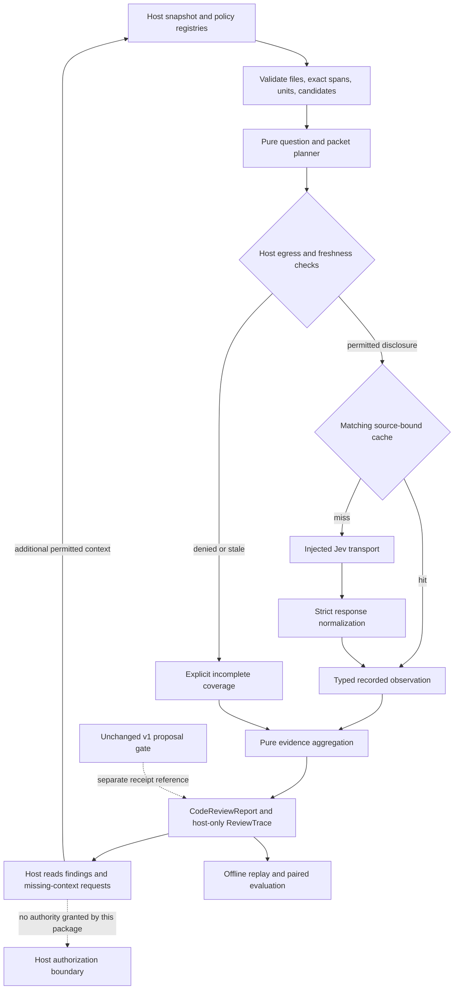

# Evidence-backed code-review sidecar

This is an opt-in companion to the four-question proposal gate, not a new agent runtime or an approval mechanism. The existing `src/contract/`, `src/index.ts`, v1 question IDs, decision table, and receipt shape are unchanged. Import the new functionality from `src/code-review/index.ts`; host orchestration is a separate import from `src/host/code-review.ts`.

**The host freezes the change. Code validates the evidence. Jev answers narrow questions. Code records findings and coverage. The host retains authorization and execution.**

The implementation targets the repository baseline `102fb1765e6608797b27152fec669fe3b13e7ca0`. It is independent of the open gate-hardening PR stack and does not reimplement the pending playground validator/runner extraction. Those fixes and extraction remain separate work.

## Architecture



## What is implemented

| Component | Responsibility |
| --- | --- |
| `types.ts` | Independent versioned report, plan, packet, observation, coverage, and cache contracts. |
| `data.ts`, `validate.ts` | Closed JSON schemas, canonical hashes, frozen snapshots/policy, exact quoted-line checks, valid references, bounded budgets. |
| `questions.ts`, `plan.ts` | Fixed obligation catalog, optional externally generated candidates, eight-question panels, per-unit packets, explicit exclusions and exhaustion. |
| `parse.ts` | Runtime validation of Noul, Choice, and Score responses; model/option/rubric binding; normalized probability distributions and usage. |
| `aggregate.ts` | Source-backed findings, contradictions, unresolved claims, evidence graph, context requests, complete coverage accounting. No verdicts. |
| `replay.ts` | Full offline reconstruction from recorded evidence; matched differential support summaries without probability subtraction. |
| `evaluation.ts` | Label-separated candidate metrics; complete paired cohorts; split/family checks; per-run, discordance, and stability summaries. |
| `witness.ts` | Separate snapshot/claim-bound bundle of host-reported reproduction artifacts. |
| `src/host/code-review.ts` | Injected-transport shadow runner, egress/freshness checks, timeouts/cancellation, dependency-bound cache, reference-only tool wrapper. |
| `skills/jev-code-review/SKILL.md` | Agent procedure and non-authority boundaries. |
| `fixtures/code-review/synthetic.ts` | Original synthetic source and scripted distributions, never model-quality measurements. |
| `examples/code-review-shadow.ts` | Runnable offline report/replay demonstration. |

No SDK or runtime dependency is added. No provider HTTP wrapper, secret lookup, repository filesystem crawler, tool executor, permission manager, or patch application is implemented here. Those deliberately remain host capabilities, not unfinished substitutes hidden in the library.

## Host integration

Use the existing package manager and pinned dependencies:

```sh
pnpm install --frozen-lockfile
pnpm typecheck
pnpm test
pnpm exec tsx examples/code-review-shadow.ts
```

The last command uses only original synthetic text and a fake transport. Its output is explicitly marked `mock`; it is not a live Jev benchmark.

For a host integration, register the object returned by `createCodeReviewTool(host)` using the host's existing tool-registration mechanism. Its `run` function accepts exactly:

```json
{"snapshot_ref":"opaque-host-reference","review_policy_ref":"opaque-host-policy-reference"}
```

The host supplies three functions:

- `resolveSnapshot(ref)` returns a source inventory reconstructed and validated by the host, not an LLM-authored claim that a snapshot is authoritative.
- `resolvePolicy(ref)` resolves a host-reviewed immutable policy. Registry access must be scoped to the caller; a reference is not itself a permission grant.
- `optionsForSnapshot(ref)` supplies transport, data classification, egress policy, current-snapshot identity, cancellation, deadlines, and optional cache.

The wrapper rejects arbitrary additional arguments, including caller-supplied thresholds or model names. The direct `runCodeReview` library API also exists for trusted host code; it is not an authorization boundary for untrusted callers.

`source: jev` requires a `currentSnapshotHash` callback. That callback must reflect the currently proposed bytes and task, using the same normalized `SnapshotInput` hash. Merely returning the previously calculated hash is not a freshness check. The host still rechecks freshness when consuming a report or executing any separately authorized action.

The injected transport receives a frozen payload and `AbortSignal`, and returns the documented API response. It owns authenticated HTTP, credentials, network policy, and provider identity. This package validates the reported pinned model name but cannot independently authenticate the model or host. No test calls a live provider or reads an API key.

## Snapshot and evidence contract

`SnapshotInput` contains the exact task, base/head revision references, proposed diff, source files, quoted spans, changed units, and optional candidate hypotheses. A file has an ID, canonical relative path, base/head side, and text. A span supplies its file ID and inclusive line range; its quote must match those lines exactly. Line splitting uses LF and preserves any CR characters in the supplied file. Hosts must use consistent source encoding.

`ReviewUnit` declares source-span IDs and any host-justified exclusions. The host is responsible for deriving the complete changed-unit inventory and validating that the diff, revisions, and source files actually describe the same proposed change. The sidecar checks the declared inventory; it cannot prove that an omitted file or caller does not exist. Keep the existing canonical proposal validator/extraction separate.

Additional candidates declare one unit, one obligation, a concrete claim, supporting and opposing source references, and missing-context selectors. Candidate origin is recorded but is neither authority nor semantic proof. Origin labels and evaluation labels are not included in the model's candidate objects. Catalog candidates exist independently of proposer-supplied hypotheses.

Unknown schema fields, duplicate identifiers, path traversal, fabricated quotes, invalid references, executable objects, cyclic data, prototype keys, and non-finite values fail locally. The snapshot and policy are copied and deeply frozen before any asynchronous call.

## Eight obligations and eight questions

The fixed obligations are requirement alignment, caller compatibility, error semantics, test assertions, trust-boundary checks, resource lifecycle, concurrency invariants, and explicit performance bounds. These are focused hypothesis templates, not a universal defect taxonomy. Each catalog or supplied candidate gets an atomic panel:

| Dimension | Primitive | Meaning |
| --- | --- | --- |
| Context | Choice | Sufficient, missing context, or not applicable. |
| Support | Noul | Does actual supplied source support this exact claim? |
| Contradiction | Noul | Does a concrete supplied fact defeat the claim? |
| Introduced | Choice | Introduced, pre-existing, not a defect, or unresolved lineage. |
| Test relevance | Choice | An assertion checks the claim, does not check it, no test is supplied, or uncertain. This never implies execution. |
| Conditional impact | Score | Four explicit consequence levels, conditional on the claim being real. |
| Evidence | Choice | Supplied supporting span or an explicit sentinel. |
| Counterevidence | Choice | Supplied opposing span or an explicit sentinel. |

Every question names its candidate in the instruction text: routing IDs are not model context. The model sees only the relevant unit's supplied spans and candidates, not the full repository or benchmark labels. Code constructs claims/spans and candidate relationships before querying; independently selected output fields are not blindly joined into a new claim.

The planner enforces at most 252 source-span options plus `none`, `insufficient_context`, and `outside_packet`. It does not truncate excess source silently. The 255 limit applies to Choice options, not a 255-question limit. `maxQuestionsPerRequest` is an explicit local budget, not a claim about a provider limit.

## Budgets and staging

The versioned model pin is `jev-1.13.0`. Defaults reserve room under the documented 64k total request context and 32k state-plus-longest-question limits: 60,000 and 30,000 estimated tokens respectively. Other budgets bound request count, total estimated input, and response bytes. A candidate panel is indivisible. The planner records an exhausted obligation rather than sending only favorable or inexpensive questions from its panel.

`PlanningDependencies` injects SHA-256 and a versioned token counter. The supplied Node adapter uses UTF-8 byte length plus an explicit 256-unit framing reserve for conservative demonstration accounting. This is an estimate, not Jev's tokenizer or a guarantee about undocumented framing. A real host should supply a measured tokenizer/counter and retain provider usage. Counter changes invalidate packet keys. The runner stops further dispatch when observed usage consumes the total budget; it cannot retroactively prevent a request whose actual cost exceeded its estimate.

Questions within a packet share evidence but do not receive one another's answers. A missing caller or contract produces an evidence request. The host retrieves only permitted context, creates a fresh snapshot, and runs the next stage. The library does not follow arbitrary model-returned file paths or recursively acquire permissions. Request order and budgets are deterministic; there are no automatic provider retries.

## Findings, confidence, and coverage

The report distinguishes `supported`, `contradicted`, `not_supported`, `unresolved`, and `not_applicable` candidate assessments. These are evidence-assessment states, not additions to `ReviewVerdict`.

A supported finding requires sufficient context, high claim support, low contradictory assessment, and an actual selected source span. High support together with high contradiction remains unresolved. A low support answer is not necessarily counterevidence. Provider `confidence` is retained but is not substituted for the relevant answer's probability mass, and probabilities are never multiplied into a patch-correctness score.

The separate support, contradiction, and context thresholds default to 0.8 solely as experimental starting values. They are uncalibrated for code review. Tune on an independently labeled calibration split, freeze the profile, and evaluate on held-out families. Impact and test relevance remain diagnostic rather than hidden approval gates.

Every unit has a ledger entry for each catalog obligation: `assessed`, `not_applicable`, `missing_context`, `excluded_by_policy`, `budget_exhausted`, or `provider_unavailable`. All scheduled candidate panels must resolve before an obligation is assessed. Unresolved lineage is retained even when the local defect claim is supported. Intentional profile exclusions remain visible and keep the overall report incomplete. `complete` means the declared procedure completed without such omissions; it is never a correctness or authorization certificate.

Raw provider error messages are not recorded. Fixed failure codes distinguish egress denial/error, cancellation, timeout, transport/malformed response, stale snapshot, and budget exhaustion. Missing output never becomes a negative prediction.

## Cache and replay

Packet keys bind the exact payload, full contents of every referenced file through its hash, question-set version, model, policy, and counter version. This deliberately over-invalidates changes elsewhere in a relevant file. An unrelated file may change the global snapshot identity without changing a packet key. Cache hits retain the originating snapshot, revalidate the complete response, and do not rebill historical token usage.

A cache entry from `mock` cannot be reused as `jev`. Malformed entries are misses. A failing cache does not supply semantic evidence. Cache storage, TTL, retention, confidentiality, and authenticity are host responsibilities. A pinned model name does not imply a model backend can never change operationally.

`ReviewTrace` contains the frozen plan and normalized observations needed for replay. `replayReview` reconstructs the plan, validates responses and provenance, reruns aggregation, and compares the report hash without a model or transport. Internal hashes detect inconsistent modification; anyone who can rewrite and rehash the entire trace can create a different internally consistent trace. Use host signing/authenticated storage where origin authentication is required.

Traces contain source text, including files not transmitted in a particular packet. Do not publish them by default. Redact before planning and rehash the resulting view; never change an excerpt after its receipt was bound. `relatedReceiptRef` is only a reference to a host-held v1 receipt. Bind it to an authenticated host session/snapshot using the separate host receipt mechanism, not the string alone.

## Differential review and reproduction

`compareReviews` compares matched stable candidate IDs under the same task, policy, model, source and question version. It reports newly supported, no longer supported, persistent, unresolved, or neither-supported claims. Changed/missing claim identities are unresolved. These are observational changes, not proof that a patch caused a defect. Hosts must maintain meaningful unit/candidate lineage across revisions.

`bindReproductionWitnesses` creates a separate bundle for host-supplied test evidence. Each witness binds the exact candidate claim and snapshot, a test-run reference, an artifact hash, and a reproduced/not-reproduced/inconclusive outcome. Its source remains explicitly `host_reported`. It does not execute tests, inspect artifacts, authenticate their origin, or overwrite the semantic report's evidence level.

## Evaluation

Use `rowFromReport`, `evaluateReviews`, and `evaluatePairedReviews` with labels kept outside snapshots. The manifest declares cases, families, one split, arms and their pinned treatment provenance, and repeated run IDs. Every declared case × arm × run is required. Missing rows, duplicate rows, changed snapshots, mixed treatment provenance, unlabeled predictions, and cross-split family leakage are rejected. Missing candidate predictions remain unresolved; omitted positive claims count against operational recall.

Outputs include candidate-level precision/recall, true/false positive counts, unresolved counts, probability coverage, Brier score, coverage fraction, comments per clean case, latency mean/p95, known tokens, and unknown-usage rows. Paired summaries expose discordance and finding/latency deltas; repeated summaries expose per-run metrics and stability. Multiple candidates can describe the same defect: these are candidate metrics, not deduplicated real-defect or repository-wide recall.

The simple Wilson interval is withheld when multiple correlated claims, repeated runs, or shared families are present. Even the restricted single-claim/single-run/distinct-family interval relies on the statistical independence assumption; a family label cannot establish that assumption. Repetition measures stability, not new independent examples.

The evaluator can consume host-normalized deterministic-only, v1-gate, LLM-only, fixed-panel, and fixed-plus-candidate arms. It does not invent baseline predictions, invoke an LLM, or claim to have run the pending upstream fixture bench. Define comparable outcomes before interpreting a broad v1 gate as a candidate-level comparator.

## Validation and release gate

Automated tests use original synthetic text and injected fake responses. They exercise protocol, source binding, failure behavior, coverage, caching, replay, differential reporting, host-only witnesses, and paired accounting. They do not establish Jev's semantic code-review accuracy, prompt-injection resistance on real repositories, or live latency.

See [implementation verification](code-review-verification.md) for the actual environment and commands executed. Require the repository's pinned typecheck/test and secret-scan CI on the PR head, the repository's signed-commit requirements, and maintainer review before merge. A live pilot and threshold calibration are separate opt-in experiments with a reviewed egress policy. Neither is represented as completed by mock results.

## Primary API references

Checked September 22, 2026:

- [TypeSafe API](https://docs.typesafe.ai/api): request/response shapes, routing IDs, primitive distributions, maximum Choice and Score sizes.
- [TypeSafe models](https://docs.typesafe.ai/models): pinned model and context limits; model aliases can move.
- [Choice](https://docs.typesafe.ai/primitives/choice): closed-set selection and full distributions.

This is a community implementation, not an official TypeSafe product or a safety guarantee.
